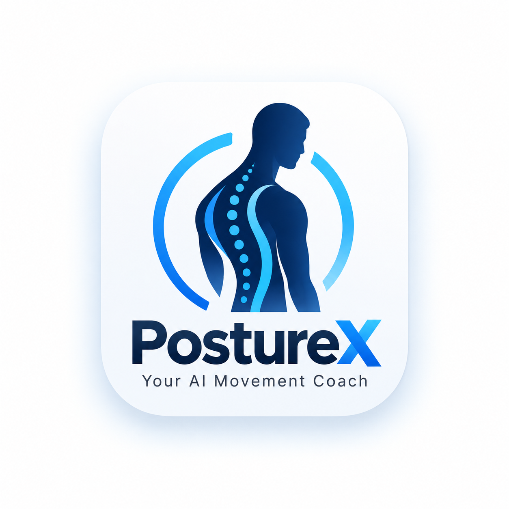
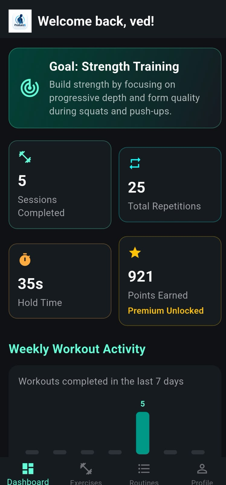
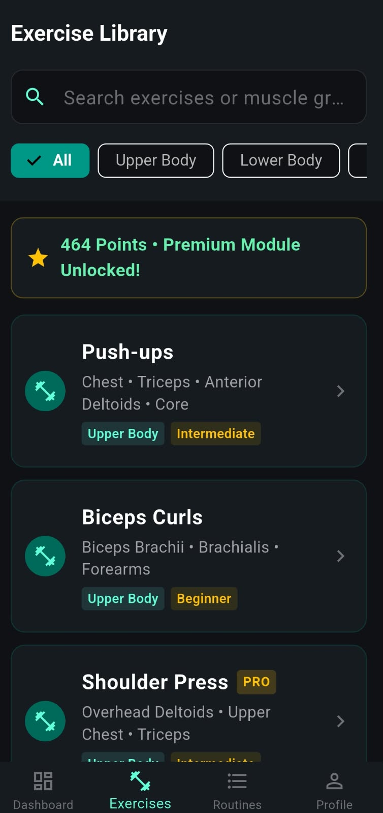
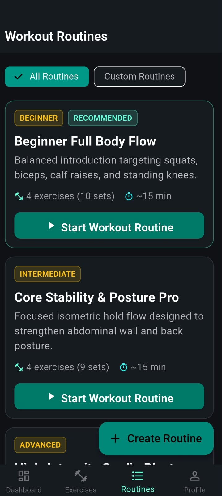
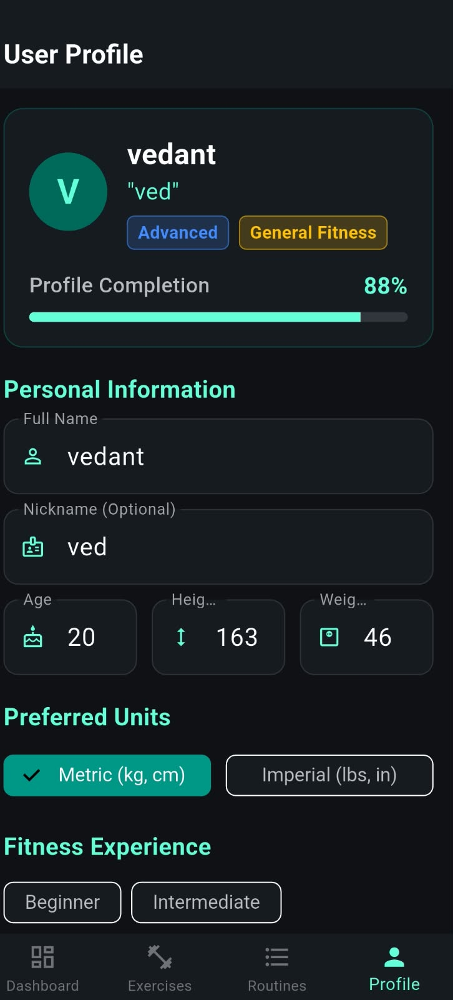

# PostureX — Your AI Movement Coach

<p align="center">
  
</p>

<p align="center">
  <strong>Your personal AI-powered fitness and movement coach.</strong><br>
  Real-time pose analysis, repetition counting, posture feedback, and workout tracking — designed with privacy in mind.
</p>

<p align="center">
  Built with Flutter, Dart, and Google ML Kit Pose Detection
</p>

---

## About PostureX

PostureX is a local-first mobile fitness application that analyzes body movements using on-device pose detection. It helps users track exercises, monitor workout performance, receive voice coaching feedback, and maintain their fitness progress.

The application stores workout history and profile information locally, without requiring a cloud account.

## Key Features

### AI-Powered Movement Analysis
- Real-time body pose detection using Google ML Kit.
- Joint-angle calculations with smoothing and visibility checks.
- Exercise-specific movement analysis and repetition counting.
- Form scoring and movement feedback.
- Static-hold timing and posture calibration.

### Exercise Library
- 23 structured exercises across five categories:
  - Upper Body
  - Lower Body
  - Core
  - Full Body & Cardio
  - Mobility & Yoga
- Exercise search and category filters.
- Target muscle information and camera-positioning guidance.

### Personalized Dashboard
- User profile with fitness goals and experience level.
- Workout sessions, repetition counts, and hold-time statistics.
- Reward points and personal records.
- Weekly activity visualization.

### Guided Workouts
- Preloaded workout routines.
- Custom routine creation.
- Sets, repetitions, hold durations, and rest intervals.
- Guided workout player with exercise transitions and countdown timers.

### Privacy-Focused Storage
- Local SQLite database for profile information and workout history.
- On-device pose processing.
- No cloud account or authentication required.

## App Screenshots

### Dashboard


### Exercise Library


### Workout Routines


### User Profile


## Technology Stack

| Technology | Purpose |
|---|---|
| Flutter & Dart | Cross-platform application development |
| Google ML Kit Pose Detection | On-device body pose detection |
| SQLite & sqflite | Local data storage |
| flutter_tts | Voice coaching feedback |
| Flutter Material 3 | Application UI and dark theme |
| Flutter Test | Automated testing |

## Project Structure

```text
lib/
├── data/           # Exercise catalog and structured data
├── models/         # Exercise, profile, routine, and record models
├── screens/        # Dashboard, tracking, routines, profile, and UI
├── services/       # Pose analysis, database, scoring, and feedback
└── theme/          # Centralized application theme

assets/
└── branding/       # PostureX branding assets

test/
└── database_service_test.dart

docs/
├── architecture.md
├── database.md
├── testing.md
└── screenshots/
```

## Getting Started

### Prerequisites

- Flutter SDK compatible with the project's dependency requirements.
- Android Studio or VS Code with Flutter and Dart extensions.
- Android device or emulator running Android 7.0 (API 24) or later.
- Camera access for live pose detection.

### Installation

1. Clone the repository or open your existing project directory.

2. Install dependencies:

   ```bash
   flutter pub get
   ```

3. Check the project for static analysis issues:

   ```bash
   flutter analyze
   ```

4. Run automated tests:

   ```bash
   flutter test
   ```

5. Connect an Android device or start an emulator, then run:

   ```bash
   flutter run
   ```

Grant camera permission when prompted to use live movement tracking.

## Testing

The project includes automated database tests covering:

- Default application points.
- Reward-point accumulation.
- Workout session saving and retrieval.
- Personal-record handling.
- Dashboard statistics aggregation.

Previously recorded verification results include 21 passing Flutter tests, clean Flutter analysis, and a successful Android release build. Re-run the commands above to verify the current version after making changes.

## Documentation

Explore the technical documentation:

- [Technical Architecture](docs/architecture.md)
- [Database Design and Schema](docs/database.md)
- [Testing Documentation](docs/testing.md)

## Privacy

PostureX is designed around local data storage and on-device processing.

- Camera frames are processed on the device for pose detection.
- Workout sessions, profile information, and statistics are stored in the local SQLite database.
- The application does not require a cloud account or authentication.

These statements describe the intended application design; they do not constitute an independent security audit.

## Future Improvements

Potential areas for future development include:

- Expanded movement-analysis testing across different devices and camera positions.
- Additional exercises and workout customization.
- Improved accessibility and coaching feedback.
- More comprehensive automated testing.

## Contributing

Contributions, bug reports, and suggestions are welcome. Before submitting changes, run:

```bash
flutter analyze
flutter test
```

## License

Add the appropriate license before distributing or accepting external contributions. No license is specified in this README yet.