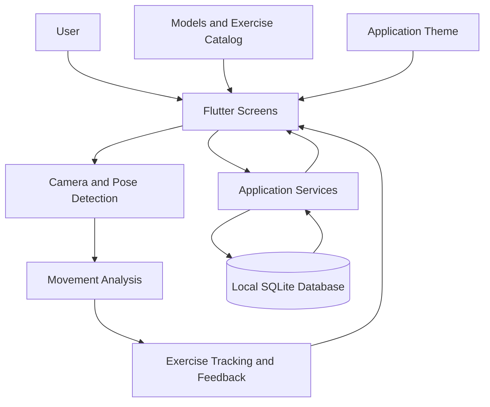

# PostureX — Technical Architecture

## 1. Overview

PostureX is a mobile AI fitness application developed using Flutter and Dart. It combines camera-based pose detection, movement analysis, workout tracking, voice feedback, and local data storage to provide a guided exercise experience.

The application is organized into five main areas:

- **Screens:** User interface and navigation.
- **Services:** Movement analysis, tracking, persistence, and supporting logic.
- **Models:** Structured representations of exercises, user profiles, workout routines, and personal records.
- **Data:** Exercise catalog and predefined exercise information.
- **Theme:** Shared application styling and visual design.

## 2. High-Level Architecture

The following diagram represents the main logical components of PostureX.



This is a conceptual view of the application. The exact call sequence and dependencies should be verified against the corresponding Dart implementations.

## 3. Application Structure

### 3.1 Entry Point

**File:** `lib/main.dart`

The application entry point initializes and launches the Flutter application.

### 3.2 Screens

**Directory:** `lib/screens/`

The screen layer provides the application's user-facing functionality.

| Screen | Responsibility |
|---|---|
| `home_screen.dart` | Main application navigation |
| `dashboard_screen.dart` | Workout statistics and activity summaries |
| `exercise_library_screen.dart` | Exercise browsing and filtering |
| `exercise_detail_screen.dart` | Exercise information and setup guidance |
| `tracking_screen.dart` | Camera-based exercise tracking interface |
| `routine_list_screen.dart` | Workout routine listing |
| `routine_editor_screen.dart` | Creating and editing workout routines |
| `routine_player_screen.dart` | Guided workout execution |
| `session_summary_screen.dart` | Post-workout summary |
| `profile_screen.dart` | User profile management |

### 3.3 Services

**Directory:** `lib/services/`

The service layer contains reusable application logic.

| Service | Responsibility |
|---|---|
| `angle_calculator.dart` | Joint-angle calculations and smoothing |
| `calibration_manager.dart` | Exercise start-position calibration |
| `database_service.dart` | SQLite database operations and migrations |
| `form_scorer.dart` | Exercise form scoring |
| `hold_timer.dart` | Timing static exercise holds |
| `jumping_jack_detector.dart` | Jumping-jack movement detection |
| `movement_analyzer.dart` | Exercise-specific movement analysis |
| `points_service.dart` | Workout reward points |
| `pose_stability_tracker.dart` | Pose stability assessment |
| `pose_visibility_checker.dart` | Pose landmark visibility checks |
| `profile_service.dart` | Profile-related operations |
| `rep_detector.dart` | Repetition detection |
| `routine_service.dart` | Workout routine operations |
| `voice_feedback_service.dart` | Text-to-speech coaching feedback |

### 3.4 Models

**Directory:** `lib/models/`

The model layer defines the application's structured data.

- `exercise.dart` — Exercise information and categories.
- `personal_record.dart` — Personal record data.
- `user_profile.dart` — User profile and preferences.
- `workout_routine.dart` — Workout routines and their items.

### 3.5 Exercise Catalog

**File:** `lib/data/exercise_catalog.dart`

The exercise catalog provides structured exercise definitions used by the application.

### 3.6 Theme

**File:** `lib/theme/app_theme.dart`

The theme centralizes visual styling for a consistent user interface.

## 4. Movement Analysis

PostureX uses Google ML Kit Pose Detection for camera-based pose analysis.

The movement-analysis components include:

1. **Pose detection:** Identifies body landmarks from camera input.
2. **Visibility checks:** Evaluates whether the required landmarks are sufficiently visible.
3. **Joint-angle calculations:** Calculates angles from body landmarks.
4. **Movement analysis:** Applies exercise-specific movement logic.
5. **Repetition and hold tracking:** Uses dedicated components to track supported exercise movements and static holds.
6. **Feedback:** Provides visual guidance and voice feedback where implemented.

Actual detection thresholds, supported movements, and feedback rules are defined in the source code and may differ by exercise.

## 5. Data Storage

PostureX uses SQLite through the `sqflite` package for local persistence.

The database service is responsible for database operations and schema migrations. Other application services manage their respective profile, routine, and points-related functionality.

See [Database Documentation](database.md) for details about the database schema, persistence operations, and migrations.

## 6. Testing

The project includes automated Flutter tests.

Run the test suite from the project root:

```bash
flutter test
```

Run static analysis with:

```bash
flutter analyze
```

See [Testing Documentation](testing.md) for test coverage and additional manual validation procedures.

## 7. Related Documentation

- [Project README](../README.md)
- [Database Documentation](database.md)
- [Testing Documentation](testing.md)

## 8. Implementation Notes

This document describes the logical architecture based on the current project structure. Detailed claims about component dependencies, processing guarantees, database tables, and data flow should be confirmed against the implementation before being treated as definitive.
