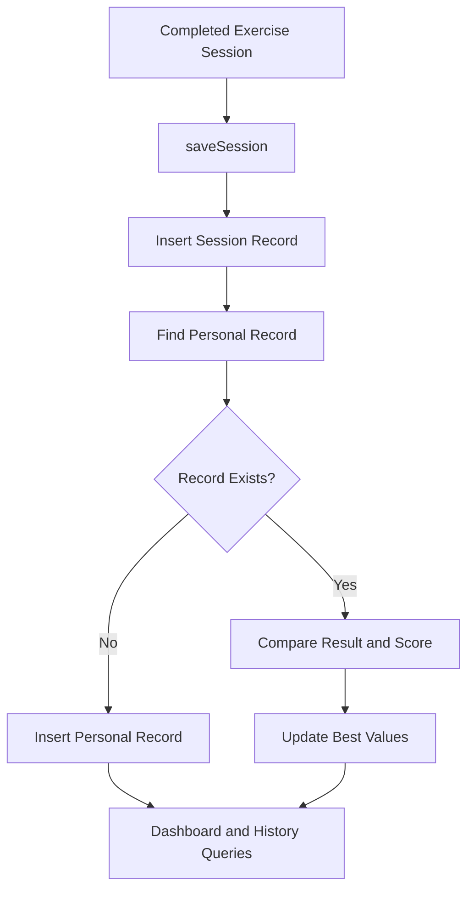

# PostureX — Database Documentation

## 1. Overview

PostureX uses SQLite through the Flutter `sqflite` package to persist application data locally.

The database is named `posture_coach.db` and uses schema version **3**. Database creation, migrations, and data-access operations are managed by `lib/services/database_service.dart`.

## 2. Database Tables

The database service defines five tables: `app_state`, `sessions`, `user_profile`, `personal_records`, and `workout_routines`.

### 2.1 `app_state`

Stores application-wide points and premium-unlock status.

| Column | Type | Description |
|---|---|---|
| `id` | INTEGER | Primary key; the default application record uses ID `1` |
| `total_points` | INTEGER | Accumulated reward points; defaults to `0` |
| `premium_unlocked` | INTEGER | Premium-unlock flag; defaults to `0` |

The service reads and updates this record to retrieve total points, add points, and mark premium as unlocked.

### 2.2 `sessions`

Stores completed workout-session results.

| Column | Type | Description |
|---|---|---|
| `id` | INTEGER | Auto-incrementing primary key |
| `exercise` | TEXT | Exercise name; required |
| `result_value` | REAL | Recorded exercise result; required |
| `avg_score` | REAL | Average form score; nullable |
| `points_earned` | INTEGER | Points awarded for the session; required |
| `timestamp` | TEXT | Session timestamp in ISO 8601 format; required |

The `saveSession()` method inserts a session with the current timestamp and then updates the corresponding personal record.

Session history is retrieved in descending timestamp order. The default history limit is 50 entries.

### 2.3 `user_profile`

Stores the user's profile and exercise preferences.

| Column | Type | Description |
|---|---|---|
| `id` | INTEGER | Primary key |
| `name` | TEXT | User name; required |
| `nickname` | TEXT | Optional nickname |
| `age` | INTEGER | Optional age |
| `height` | REAL | Optional height |
| `weight` | REAL | Optional weight |
| `experience_level` | TEXT | Experience level; required |
| `fitness_goal` | TEXT | Fitness goal; required |
| `preferred_duration` | TEXT | Preferred duration; required |
| `unit` | TEXT | Measurement-unit preference; required |
| `profile_image_path` | TEXT | Optional profile-image path |
| `notes` | TEXT | Optional notes |

When the version 2 table is created, the database service checks whether a profile with ID `1` exists. If not, it inserts the default `UserProfile`.

### 2.4 `personal_records`

Stores the best recorded result and score for each exercise.

| Column | Type | Description |
|---|---|---|
| `exercise` | TEXT | Primary key identifying the exercise |
| `max_result` | REAL | Highest recorded result |
| `best_score` | REAL | Highest recorded score |
| `updated_at` | TEXT | Timestamp of the last record update |

When a session is saved, the service checks whether a personal record exists for that exercise.

- If no record exists, it creates one.
- If a record exists, it compares the new result and score with the stored values.
- It retains the higher result and higher score, then updates the timestamp.

If the session's average score is null, the current implementation uses `10.0` when updating the personal record.

### 2.5 `workout_routines`

Stores predefined and user-created workout routines.

| Column | Type | Description |
|---|---|---|
| `id` | TEXT | Primary key |
| `name` | TEXT | Routine name; required |
| `description` | TEXT | Routine description; required |
| `difficulty` | TEXT | Difficulty level; required |
| `fitness_goal` | TEXT | Associated fitness goal; required |
| `estimated_minutes` | INTEGER | Estimated duration; required |
| `is_custom` | INTEGER | Custom-routine flag; defaults to `0` |
| `exercises_json` | TEXT | Serialized exercise data; required |
| `created_at` | TEXT | Routine creation timestamp; required |

When the table is created, the service checks whether any routines exist. If the table is empty, predefined routines are inserted.

The service also provides operations to retrieve routines, save routines, and delete routines by ID.

## 3. Schema Versions and Migrations

The database currently declares schema version `3`.

| Version | Tables introduced |
|---|---|
| Version 1 | `app_state`, `sessions` |
| Version 2 | `user_profile`, `personal_records` |
| Version 3 | `workout_routines` |

### Database creation

For a new database, the service creates the version 1 tables, followed by the version 2 and version 3 tables.

### Database upgrade

The `onUpgrade` callback checks the previous database version:

- If the previous version is below `2`, the version 2 tables are created.
- If the previous version is below `3`, the version 3 table is created.

### Database-open repair

The `onOpen` callback also calls the version 2 and version 3 table-creation methods. These methods use `CREATE TABLE IF NOT EXISTS`, allowing the service to repair missing tables in older databases without recreating tables that already exist.

The version 2 method also ensures that a default profile exists, while the version 3 method inserts predefined routines if the routine table is empty.

## 4. Session and Personal-Record Data Flow



The diagram represents the sequence implemented by `saveSession()` and `_updatePersonalRecord()`.

## 5. Dashboard Statistics

The `getDashboardStats()` method retrieves session history, total points, the user profile, and personal records. It then calculates dashboard metrics, including total sessions, repetition totals, hold time, and weekly activity.

The exact interpretation of `result_value` depends on the exercise and the logic used by the tracking implementation.

## 6. Testing

Database behavior is covered by `test/database_service_test.dart`.

Run the complete automated test suite from the project root:

```bash
flutter test
```

The project has previously passed 21 automated tests, including database tests. Re-run the suite after future database changes.

## 7. Implementation Reference

Primary implementation:

- `lib/services/database_service.dart`
- `lib/models/user_profile.dart`
- `lib/models/personal_record.dart`
- `lib/models/workout_routine.dart`
- `test/database_service_test.dart`

For the broader application design, see [Architecture Documentation](architecture.md).
